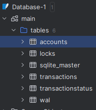

# Server Configurations

## Overview
This document outlines the configurations for the servers and the View Server responsible for handling transactions.

## Server Details
The following servers have been considered:

| Server Name          | Port Number |
|----------------------|-------------|
| S1                   | 8001        |
| S2                   | 8002        |
| S3                   | 8003        |
| S4                   | 8004        |
| S5                   | 8005        |
| S6                   | 8006        |
| S7                   | 8007        |
| S8                   | 8008        |
| S9                   | 8009        |
| S10                  | 8010        |
| S11                  | 8011        |
| S12                  | 8012        |
| Client / View Server | 8000        |
|                      |             |

## View Server
This is actually not a View Server by definition. This is just a bridge between Input File and servers.

Like an Input Controller Client. This represents a Client that sends transactions to all the servers.

## Commands

| Command Names    | Command Details                                       |
|------------------|-------------------------------------------------------| 
| PrintDataStore   | Prints Datastore of each server                       |
| PrintBalance     | Prints Balance of Data Items in cluster's servers     |
| PrintPerformance | Prints Performance                                    |

## During Execution
After every Test Set, code automatically sends PrintDataStore, PrintStatus, PrintBalance and PrintPerformance commands to the servers.
The Outputs will be logged to "Logs/8000-Commands.txt" file

Client Retries until it receives Executed Response from f+1 Servers.
In Async mode with 3-6 seconds delay between each retry.

PrintBalance will be sent for all participating DataItems and will be logged.

## Bonus 1 - Multiple Receivers Across Shards from a Single Sender

### CrossShardTnxProcessingThreadExtraReceiver - processes multiple receivers across shards 
- This thread is responsible for processing transactions that are sent to multiple receivers across shards.
- This thread will abort / commit based on responses from all clusters. This is a 2PC protocol across multiple Shards.
- Atomic execution. If any cluster fails, the transaction will be aborted in all clusters.

### Persistent DataStore - SQLite3
Tables stored on each Server:

## All Outputs will be logged to "Logs/8000-Commands.txt" folder
